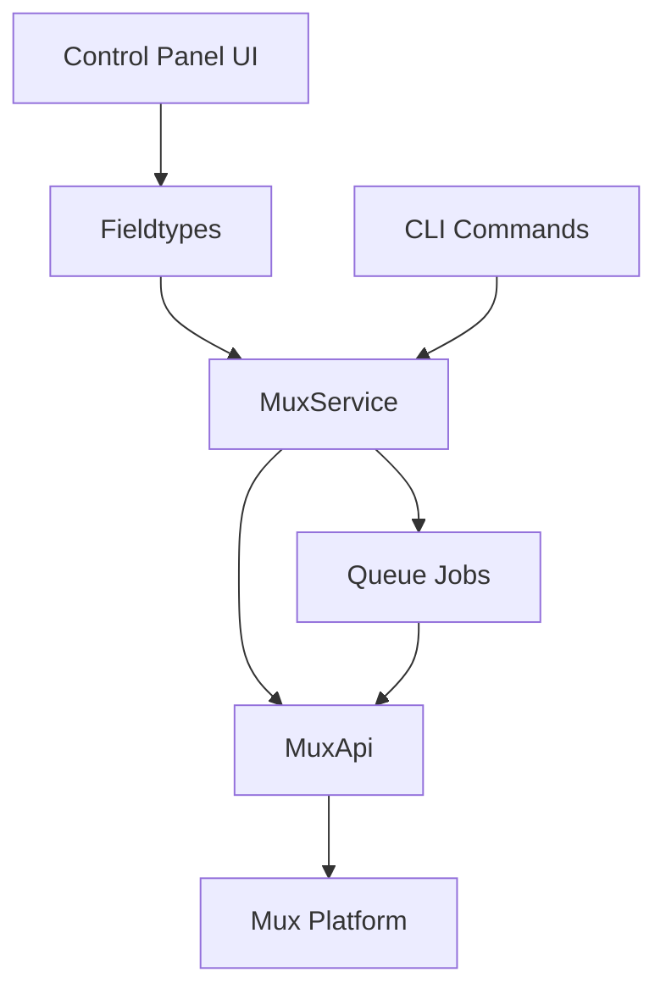

# CLAUDE.md

This file provides guidance to Claude Code (claude.ai/code) when working with code in this repository.

## Project Overview

The Statamic Mux addon is a purpose-built integration between the Statamic CMS and the Mux video streaming and encoding platform. It enables content editors to upload and manage video content in a seamless workflow within the Statamic control panel while leveraging Mux's video processing and delivery capabilities in the background.

### Core Objectives

- Provide a seamless editing experience by mirroring local videos to Mux
- Simplify video embedding and rendering through Antlers frontend tags and official Mux web components

### Key Features

- Automated asset mirroring to Mux via background queue jobs
- Templating tags for frontend video rendering
- GraphQL API extensions for headless implementations
- Secure playback policy enforcement

### User Experience Goals

- **For Content Editors**: Manage videos directly within the familiar Statamic control panel
- **For Developers**: Implement video playback with simple template tags
- **For End Users**: Experience fast-loading, adaptive video playback across all devices

### Primary Workflows

#### Video Asset Management

1. Content editor uploads video through Statamic's asset manager
2. System automatically mirrors the asset to Mux (async job)
3. Mux processes video for optimal delivery
4. Playback IDs and metadata are stored with Statamic asset

#### Frontend Implementation

1. Developer implements templating tags in Antlers templates
2. System generates appropriate embed code based on context
3. Frontend visitors receive optimized video streams

## Architecture

The addon follows a service-oriented architecture with clear separation of concerns:

### Core Components

- **MuxService** (`src/Mux/MuxService.php`): Main service class that orchestrates all Mux operations including asset creation, deletion, and playback ID management.
- **MuxApi** (`src/Mux/MuxApi.php`): Wrapper around the Mux PHP SDK for API interactions.
- **MuxAsset** (`src/Data/MuxAsset.php`): Data class representing a Mux asset with an underlying local Asset.
- **ServiceProvider** (`src/ServiceProvider.php`): Registers all services, commands, fieldtypes, and tags with Laravel/Statamic.

### Key Patterns

- **Actions Pattern**: Complex operations are handled by dedicated Action classes in `src/Mux/Actions/`
- **Queue Integration**: Heavy operations like asset upload/deletion are queued using `src/Jobs/`
- **Event System**: Asset lifecycle events are fired for extensibility
- **Hook System**: Custom hooks are fired for extensibility during asset operations

### Configuration

Configuration is handled through `config/mux.php` with keys for:

- Mux API credentials (`token_id`, `token_secret`)
- Playback policies and signing keys
- Queue and webhook settings

### Asset Flow

1. Videos uploaded to Statamic are detected by `MirrorFieldSubscriber`
2. Assets are queued for upload to Mux via `CreateMuxAssetJob`
3. Mux returns asset ID and playback IDs are generated
4. Metadata is stored in Statamic's asset meta
5. Templates can render videos using Mux tags

### Testing

Tests use Pest framework with custom concerns in `tests/Concerns/`:

- `DealsWithAssets` - Asset creation helpers
- `ExtendsAssetBlueprint` - Blueprint extension utilities
- `InteractsWithAntlersViews` - Template testing helpers

Mock fixtures are stored in `tests/__fixtures__/` for consistent testing.

## Development

### Dependencies and Libraries

- **PHP 8.1+**: Base language requirement
- **Laravel 9+**: Framework foundation
- **Statamic 4+**: CMS platform
- **Mux PHP SDK**: Official API client for Mux services
- **Vue 2**: Frontend components
- **Vite**: Asset building
- **PHPStan**: Static analysis
- **Laravel Pint**: Code formatting following Laravel style

### Development Commands: PHP

- `composer analyse` - Run PHPStan static analysis
- `composer format` - Format code with Laravel Pint
- `composer lint` - Check code formatting with Laravel Pint
- `composer test` - Run tests with Pest
- `composer test:coverage` - Run tests with coverage report
- `composer test:ci` - Run tests with CI coverage output

### Development Commands: JavaScript

- `npm run dev` - Start Vite development server
- `npm run build` - Build production assets
- `npm run docs:dev` - Run documentation development server
- `npm run docs:build` - Build documentation

### Laravel Artisan Commands

The addon provides three custom Artisan commands:

- `php artisan mux:mirror` - Mirror assets to Mux
- `php artisan mux:prune` - Delete orphaned assets on Mux
- `php artisan mux:upload` - Upload specific assets to Mux

### Design Decisions & Preferences

- **Code Organization**: Prefer trait-based composition over inheritance
- **Naming Conventions**:
  - `Asset` for a file managed locally by Statamic
  - `MuxAsset` for a file uploaded to and streamed by Mux
  - `MuxPlaybackId` for a unique playback ID allowing streaming from frontend components
  - `Mux` prefix for all Mux-specific classes

### Performance Considerations

- Avoid synchronous API calls in web requests
- Cache playback URLs when possible
- Use queue system effectively for background processing
- Consider storage implications of large video files

### Security Features

- Public playback IDs for open content
- Signed playback IDs with JWT tokens for restricted content
- Signed URLs with expiration timestamps

### Developer Experience Criteria

- Minimize configuration and implementation complexity for developers
- Provide flexible embedding options for different frontend scenarios
- Maintain performance through asynchronous processing

## Current Development Status

### Completed Features

- Core infrastructure (API client, configuration, asset mirroring)
- Asset management with lifecycle events
- Frontend rendering with video, player, and embed tags
- Security with signed URLs and playback policies
- CLI commands for asset operations
- Replace original videos with short placeholder clip to optimize storage

### In Progress

- Expand test coverage for critical paths

### Planned

- Control panel dashboard for Mux asset management

## Feature Plans

### Control panel dashboard

- List all Mux assets in a dedicated listing view
- Allow manual sync, deletion, and link to local assets
