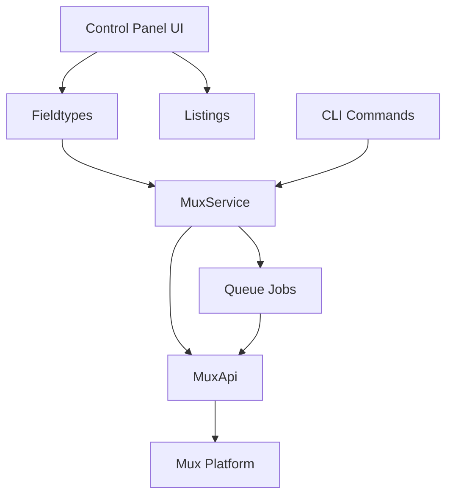
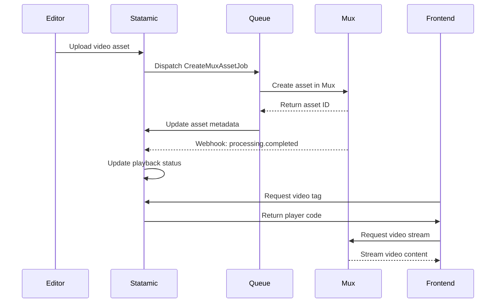

# System Patterns

## Architecture Overview

The Statamic Mux addon follows a service-oriented architecture with clear separation of concerns:



## Core Design Patterns

### Facade Pattern

The `Mux` facade provides a clean interface to the complex service implementation:

```php
// Usage example
Mux::createMuxAsset($asset);
```

### Action Pattern

Discrete operations are encapsulated in dedicated action classes:

```php
// Example from actions/CreateMuxAsset.php
public function handle(Asset $asset): bool
{
    // Implementation...
}
```

### Observer Pattern

The system uses Laravel's event system for loose coupling:

```php
// Example from subscribers/MirrorFieldSubscriber.php
public function subscribe($events)
{
    $events->listen(AssetSaved::class, [self::class, 'handleAssetSaved']);
}
```

## Asset Lifecycle

The complete lifecycle of a video asset in the system:



## Upload Process

1. User uploads a video asset in the Statamic Control Panel.
2. The asset is saved in the local filesystem or cloud storage.
3. Statamic triggers an event for the asset creation.
4. The addon listens for this event and dispatches a job to the queue.
5. The job processes the asset and uploads it to Mux.
6. Mux processes the video and returns a playback ID.
7. The addon updates the asset metadata with the Mux playback ID.
8. The asset is now ready for playback on the frontend.
9. The frontend uses Antlers tags to render the video player with the playback ID.
10. The video is streamed from Mux's CDN, ensuring optimal performance.

## Key Decision Points

### Asynchronous Processing

All Mux operations happen asynchronously to prevent blocking user interactions:

- Upload operations use Laravel's dispatchAfterResponse()
- Webhook handlers update asset status when processing completes

### Playback Security

Multiple layers of security for video content:

- Public playback IDs for open content
- Signed playback IDs with JWT tokens for restricted content
- Domain restrictions via playback policies
- Signed URLs with expiration timestamps

### Error Handling Strategy

Robust error handling through multiple mechanisms:

- Job retries with exponential backoff
- Exception capturing and logging
- Status tracking for user feedback
- Webhook validation to prevent spoofing

## Critical Implementation Paths

### Asset Creation

1. Asset created or updated in Statamic
2. MirrorFieldSubscriber detects change
3. CreateMuxAssetJob dispatched to queue
4. MuxApi creates asset in Mux platform
5. MuxAsset record created with initial status
6. Webhook updates status when processing completes

### Video Playback Rendering

1. Template uses `{{ mux:video }}` Antlers tag
2. MuxTags resolves asset from context
3. ReadsMuxData trait retrieves playback details
4. RendersMuxPlayer generates appropriate HTML
5. Frontend receives optimized video embed code
