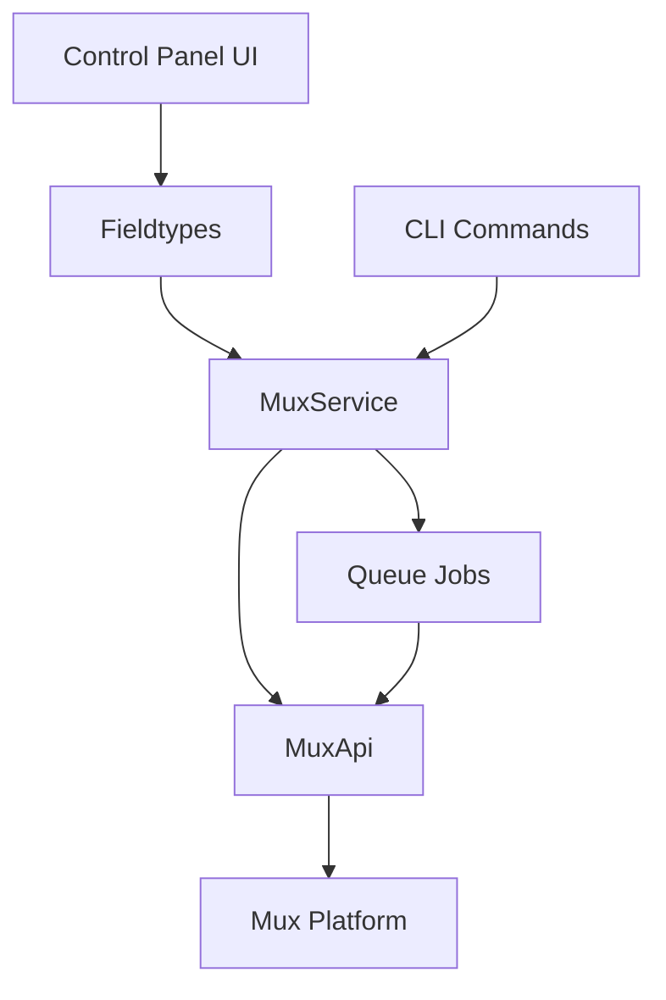

# System Patterns

## Architecture Overview

The Statamic Mux addon follows a service-oriented architecture with clear separation of concerns:



## Core Design Patterns

### Facade Pattern

The `Mux` facade provides a clean interface to the complex service implementation:

```php
Mux::createMuxAsset($asset);
```

### Action Pattern

Discrete operations are encapsulated in dedicated action classes:

```php
(new CreateMuxAsset)->handle($asset);
```

### Observer Pattern

The system uses Laravel's event system for loose coupling:

```php
AssetUploadingToMux::dispatch($asset);
```

## Asset Lifecycle

The complete lifecycle of a video asset in the system:


## Upload Process

1. User uploads a video asset in the Statamic Control Panel.
2. The asset is saved in the local filesystem or cloud storage.
3. Statamic triggers an event for the asset creation.
4. The addon listens for this event and dispatches a job to the queue.
5. The job processes the asset and uploads it to Mux.
6. Mux processes the video and returns a playback ID.
7. The addon updates the asset metadata with the Mux playback ID.
8. The asset is now ready for playback on the frontend.
9. The frontend uses Antlers tags to render the video player with the playback ID.
10. The video is streamed from Mux's CDN, ensuring optimal performance.

## Key Decision Points

### Asynchronous Processing

All Mux operations happen asynchronously to prevent blocking user interactions:

- Upload operations use Laravel's queue system
- Error handling with exponential backoff retries
- Webhook handlers update asset status when processing completes

### Playback Security

Multiple layers of security for video content:

- Public playback IDs for open content
- Signed playback IDs with JWT tokens for restricted content
- Signed URLs with expiration timestamps
